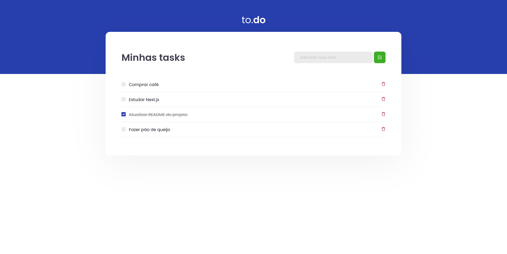

<div align="center" id="top"> 
  

  &#xa0;

  <!-- <a href="https://01githubexplorer.netlify.app">Demo</a> -->
</div>

<h1 align="center">Ignite React.js Challenge 01</h1>

<p align="center">
  

  

  

  

  

  <!--  -->

  <!--  -->
</p>

<hr>

<p align="center">
  <a href="#dart-about">About</a> &#xa0; | &#xa0; 
  <a href="#sparkles-features">Features</a> &#xa0; | &#xa0;
  <a href="#rocket-technologies">Technologies</a> &#xa0; | &#xa0;
  <a href="#white_check_mark-requirements">Requirements</a> &#xa0; | &#xa0;
  <a href="#checkered_flag-starting">Starting</a> &#xa0; | &#xa0;
  <a href="#memo-license">License</a> &#xa0; | &#xa0;
  <a href="https://github.com/{{YOUR_GITHUB_USERNAME}}" target="_blank">Author</a>
</p>

<br>

## :dart: About ##

Solution for the first challenge of Rocketseat's Ignite Bootcamp.

You can find the challenge description here (Only in Portuguese): [ignite-challenge-01-reactjs](https://www.notion.so/Desafio-01-Conceitos-do-React-51e4099a6e2f4d4bae94f9fe75bb769d#a488198f893444699a589b3efdaa1c30)
## :sparkles: Features ##

:heavy_check_mark:Add task to list;\
:heavy_check_mark: Toogle task completition;\
:heavy_check_mark: Remove task from list;

## :rocket: Technologies ##

The following tools were used in this project:

- [React](https://pt-br.reactjs.org/)
- [TypeScript](https://www.typescriptlang.org/)

## :white_check_mark: Requirements ##

Before starting :checkered_flag:, you need to have [Git](https://git-scm.com) and [Node](https://nodejs.org/en/) installed.

## :checkered_flag: Starting ##

```bash
# Clone this project
$ git clone https://github.com/leon-carvalho/ignite-reactjs-challenge-01.git

# Access
$ cd ignite-reactjs-challenge-01

# Install dependencies
$ yarn 
## Or use NPM if you prefer it
$ npm install

# Run the project
$ yarn start
## If you are using NPM use
$ npm run start

# The server will initialize in the <http://localhost:8080>
```

## :memo: License ##

This project is under license from MIT. For more details, see the [LICENSE](LICENSE.md) file.


Made with :heart: by <a href="https://github.com/leon-carvalho" target="_blank">Leonardo Carvalho</a>

&#xa0;

<a href="#top">Back to top :top: </a>
